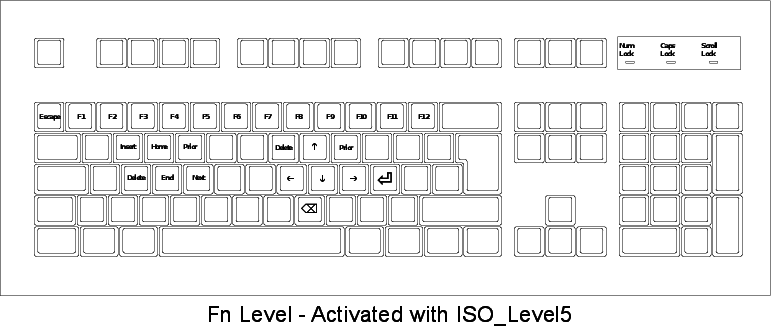

# README #

## What is this repository for?

This repository stores a custom keyboard layout created
for mapping useful keys (such as arrows keys, home keys, etc.)
to alphanumeric keys without modifying the usual keyboard behavior.
This is done through XKB configuration.

## Added functionalities

- New shift level (*Level5*) mapped to the `CAPS` key
- Map *home* keys to the left alphanumeric area
- Map *arrow* keys to right alphanumeric area
- Map the *subscript symbols* to the numeric row
- Map a ISO group toggler to the key *G* (as custom fn)
- Map the *Caps_lock* function to the *SCLK* key

### Extended functionality map

## Install this custom mapping

1. Clone the repository into a folder `.xkb` in your home directory:  
   `git clone ... ${HOME}/.xkb`
2. Go into the local XKB folder:
   `cd ~/.xkb`
3. Create a backup for your current XKB configuration
   and install the custom XKB configuration with:
   `. install.sh`
4. If you want to revert the changes reboot or set the backup configuration:  
   `. restore.sh`

## How to set up custom keymaps?

The basic steps (in a somehow hacked way, but it works!) are:

1. **types**  
   Define the new key type with all the possible shift levels.  
   This allows us to exploit previously unused shift levels,
   so that more symbols can be mapped into certain keys.  
   Put them into a new **types** file. In our case this file is `types/levelFn`.

2. **symbols**  
   Set the custom modifier keys, especially if any unusual shift level is going to be used,
   in which case this is probably not previously linked to any key, as in `symbols/levelFn`.  
   Then, customize the symbols mapped to each key, in our case in `symbols/customLayer`.

3. Create the input keymap for the **xkbcomp** application.  
   Print the current default *keymap* with  
   `setxkbmap -print > ~/.xkb/keymap/xkbbase`  
   Edit the fields in this keymap to add the new functionalities.
     In our case the new *type* with `+levelFn` and the new *symbols* with `+customLayer(Fn)`.
     We store this custom configuration file as `~/.xkb/keymap/xkbcustom`.

4. Install the new configuration with **xkbcomp**.  
   This is a compiler, so the user's path must be included, before configuration file and output to apply keymap (`$DISPLAY`).  
   In our case: `xkbcomp -I$HOME/.xkb ~/.xkb/keymap/xkbcustom $DISPLAY`.

5. To automate the installation each time a X session begins,
   add the installation command to a *.xinitrc* file in the home folder.
   If it is the first time you customize *xinitrc*
   you will probably have to copy it from `/etc/X11/xinit/xinitrc` to `~/.xinitrc`.  
   See more details about [xinitrc](https://wiki.archlinux.org/index.php/Xinitrc).

> The current configuration can be checked and debugged with  
> `xkbcomp $DISPLAY xkb.dump`

### The current file tree

The file tree consists of:

- **keymap/xkbcustom**  
  File with the configuration used by **xkbcomp** in compilation.
- **types/levelFn**  
  Add new key type "FOUR_LEVEL+LEVEL5"
  with an additional modifier LevelFive to provide an extra level (Level5) for Fn functions.
- **symbols/levelFn**  
  File with the mapping for the modifier key: Assigns the ISO_Level5 symbol to the <CAPS> key
- **symbols/customLayer**  
  Maps new symbols (arrow keys, F#, etc) to the 5th level of alphanumeric keys
- **graphics/...**  
  Printed layouts cheatsheet (modified with Inkscape)
  `-ll` is used to specify the level to print
  e.g. `xkbprint $DISPLAY -ll 5 -o xkbprint_Fn.ps`
